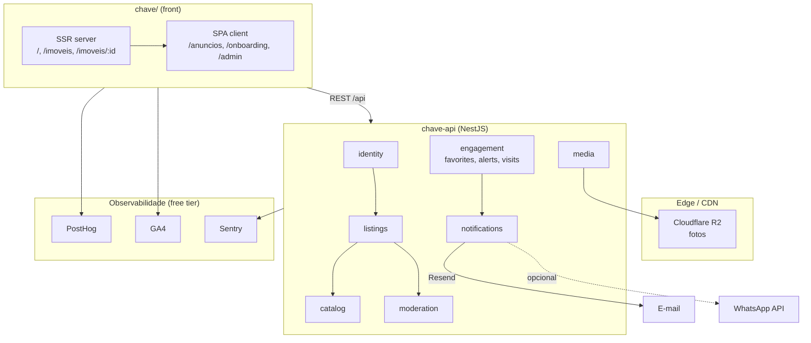
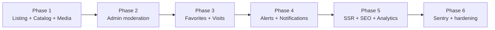
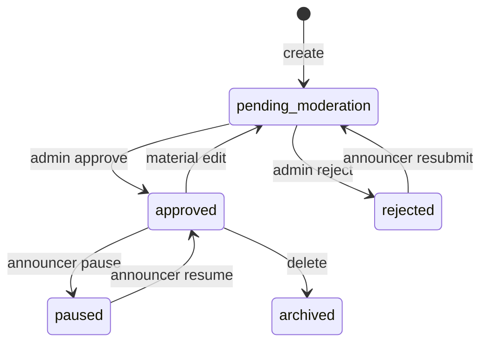

# Chave Imóveis — Beta Platform Design

**Spec**: `.specs/features/chave-imoveis/spec.md`  
**PRD**: `docs/prd/2026-08-28-chave-imoveis-prd.md`  
**Status**: Approved — 2026-08-28

---

## Architecture Overview

Sistema **dual-repo** com contrato API alinhado ao MSW existente. O beta entrega backend real em `chave-api` (NestJS) e evolui o front `chave/` de mock para integração staging, adicionando **SSR híbrido** nas rotas públicas, **portal admin** no mesmo front, e camada de **notificações** assíncrona para alertas e visitas.

### Abordagens consideradas (Large scope)

| # | Abordagem | Prós | Contras | Veredicto |
|---|-----------|------|---------|-----------|
| A | Rewrite completo para Next.js | SSR/SEO maduro, ISR para imóveis | Descarta 61 tickets de UI; curva de deploy; custo alto até dez/2026 | ❌ Rejeitada |
| B | SPA pura + prerender estático | Zero mudança de stack | Não escala para `/imoveis/:id` dinâmico; SEO insuficiente | ❌ Rejeitada |
| **C** | **Híbrido Vite SSR** (AD-PRD-15) | Reutiliza 90% do React; SSR só rotas públicas; menor custo | Duas entrypoints (`entry-client` / `entry-server`); deploy Node para SSR | ✅ **Escolhida** |

### Diagrama de sistema



### Fases de entrega (ordem de implementação)



| Phase | Escopo | Reqs | Repos |
|-------|--------|------|-------|
| **1** | Prisma Listing + CRUD anunciante + catálogo público + R2 upload | CHV-01–17 | chave-api, chave (wire API) |
| **2** | Portal admin + fila moderação | CHV-18–22 | chave-api, chave/features/admin |
| **3** | Favoritos + agendamento visita | CHV-23–26, CHV-31–35 | chave-api, chave |
| **4** | Alertas busca + worker notificações | CHV-27–30 | chave-api |
| **5** | Vite SSR híbrido + sitemap + robots + JSON-LD | CHV-36–40 | chave |
| **6** | PostHog + GA4 + Sentry + Pino | CHV-41–45 | chave, chave-api |

---

## Code Reuse Analysis

### Existing Components to Leverage

| Component | Location | How to Use |
| --------- | -------- | ---------- |
| MSW handlers (API contract) | `chave/src/mocks/handlers/` | Source of truth para shapes de request/response da API |
| `Property` / `SearchFilters` types | `chave/src/shared/types/property.ts` | Shared DTO target; mapper no back |
| Feature modules (UI) | `chave/src/features/{home,listings,property,auth,announcer}/` | Manter UI; trocar hooks para API real |
| TanStack Query hooks | `chave/src/features/*/hooks/` | Estender queryKeys; remover MSW em staging |
| Auth module | `chave-api/src/modules/identity/` | Estender User com `isAdmin`; reutilizar JWT guard |
| Error envelope | `chave-api/src/shared/http/` | Padrão `{ error: { code, message } }` |
| BR validators | `chave-api/src/shared/utils/br-documents.ts` | Reutilizar em onboarding/listings |
| Prisma + seed neighborhoods | `chave-api/prisma/` | FK `neighborhoodId` em Listing |
| Announcer types | `chave/src/features/announcer/types/listings.ts` | Alinhar `CreateListingInput` com DTO back |

### Integration Points

| System | Integration Method |
| ------ | ------------------ |
| PostgreSQL | Prisma migrations em `chave-api` |
| Cloudflare R2 | Presigned PUT via `media` module; URLs públicas em `ListingPhoto.url` |
| Resend | `notifications` module — templates e-mail (visita, alerta, moderação) |
| Google Maps | Front mantém `VITE_GOOGLE_MAPS_API_KEY`; lat/lng persistidos no Listing |
| PostHog / GA4 | SDK no `chave/src/core/analytics/` (novo) |
| Sentry | `@sentry/nestjs` no back; `@sentry/react` no front |

---

## Backend Architecture (`chave-api`)

### Module map

| Module | Responsibility | Endpoints |
| ------ | -------------- | --------- |
| `identity` | Auth, profiles (existente) | `/api/auth/*` |
| `listings` | CRUD anunciante, limite 3, visit availability | `/api/me/listings/*` |
| `catalog` | Busca pública read-only | `/api/properties/*`, `/api/neighborhoods` |
| `media` | Presigned upload R2 | `POST /api/me/listings/:id/photos/presign` |
| `moderation` | Admin queue approve/reject | `/api/admin/listings/*` |
| `engagement` | Favorites, alerts, visit requests | `/api/me/favorites`, `/api/me/alerts`, `/api/visits` |
| `notifications` | Internal — Resend + outbox | (não exposto) |
| `seo` | Sitemap XML dinâmico | `GET /sitemap.xml` (ou servido pelo SSR server) |

### Listing lifecycle (state machine)



**Regra limite 3:** contar listings com status `pending_moderation`, `approved`, ou `paused` — não contar `rejected` ou `archived`.

### API contract (paridade MSW)

Mantém prefixo `/api` e query params existentes (`op`, `city`, `neighborhood`, `maxPrice`, `sort`, `page`, `limit`, etc.). Respostas de erro usam envelope existente.

**Novo:** campos opcionais em `Property` JSON não quebram front — `status` omitido em respostas públicas.

---

## Frontend Architecture (`chave/`)

### SSR híbrido (Approach C)

| Rota | Render | Motivo |
| ---- | ------ | ------ |
| `/` | SSR | SEO home + OG |
| `/imoveis` | SSR | Listagem indexável por cidade |
| `/imoveis/:id` | SSR | Página de imóvel — core SEO |
| `/entrar`, `/cadastro`, `/onboarding/*` | SPA | Área auth — noindex |
| `/anuncios/*` | SPA | Dashboard anunciante — noindex |
| `/admin/*` | SPA | Portal admin — noindex |

**Implementação:**

```
chave/
├── server/
│   ├── index.ts          # Express + Vite middleware mode
│   └── render.tsx        # renderToString public routes
├── src/
│   ├── entry-client.tsx  # hydrate
│   ├── entry-server.tsx  # SSR shell + route match
│   └── core/seo/         # meta, JSON-LD builders
```

- **Dev:** `node server/index.ts` — Vite middleware em dev, SSR em prod build.
- **Meta/OG/JSON-LD:** funções puras em `core/seo/` recebendo dados do catalog API no server render.
- **`robots.txt`:** estático em `public/robots.txt` — disallow `/anuncios`, `/admin`, `/onboarding`.
- **`sitemap.xml`:** gerado por endpoint que consulta `GET /api/properties?status=approved&limit=1000` ou job diário.

### Portal admin (novo feature module)

```
src/features/admin/
├── pages/AdminQueuePage.tsx
├── components/ListingReviewCard.tsx
├── hooks/useModerationQueue.ts
└── api/adminApi.ts
```

- **AdminGuard:** JWT válido + `user.isAdmin === true` (403 → redirect `/`).
- **UI mínima beta:** tabela de pendentes, preview, botões Aprovar/Rejeitar com motivo.

### Analytics (novo)

```
src/core/analytics/
├── posthog.ts    # init + track()
├── ga4.ts        # gtag events
└── events.ts     # constantes CHV-41
```

---

## Data Models (Prisma)

### Enums

```prisma
enum ListingStatus {
  pending_moderation
  approved
  rejected
  paused
  archived
}

enum ListingOperation {
  rent
  sale
}

enum ListingType {
  apartment
  house
  commercial
}

enum VisitAvailabilityMode {
  weekdays      // seg–sex horário padrão
  custom        // dias/horários explícitos (JSON)
}

enum AlertChannel {
  email
  push
  whatsapp
}

enum VisitRequestStatus {
  pending
  confirmed
  cancelled
}
```

### Core models

```prisma
model Listing {
  id            String         @id @default(uuid())
  slug          String         @unique
  ownerId       String         @map("owner_id")
  owner         User           @relation(fields: [ownerId], references: [id])
  status        ListingStatus  @default(pending_moderation)
  rejectionReason String?      @map("rejection_reason")

  title         String
  type          ListingType
  operation     ListingOperation
  price         Int
  iptu          Int?
  fireInsurance Int?           @map("fire_insurance")
  serviceFee    Int?           @map("service_fee")

  city          String
  neighborhood  String
  neighborhoodId String?       @map("neighborhood_id")
  neighborhoodRef Neighborhood? @relation(fields: [neighborhoodId], references: [id])
  address       String
  lat           Float?
  lng           Float?

  bedrooms      Int
  bathrooms     Int
  parkingSpots  Int            @map("parking_spots")
  area          Int
  description   String
  amenities     String[]
  featured      Boolean        @default(false)
  badge         String?

  visitMode     VisitAvailabilityMode @default(weekdays) @map("visit_mode")
  visitSchedule Json           @default("{}") @map("visit_schedule")

  photos        ListingPhoto[]
  favorites     Favorite[]
  visitRequests VisitRequest[]

  createdAt     DateTime       @default(now()) @map("created_at")
  updatedAt     DateTime       @updatedAt @map("updated_at")
  approvedAt    DateTime?      @map("approved_at")

  @@index([status, city, operation])
  @@index([ownerId, status])
  @@map("listings")
}

model ListingPhoto {
  id        String  @id @default(uuid())
  listingId String  @map("listing_id")
  listing   Listing @relation(fields: [listingId], references: [id], onDelete: Cascade)
  url       String
  sortOrder Int     @default(0) @map("sort_order")
  r2Key     String  @map("r2_key")

  @@map("listing_photos")
}

model Favorite {
  userId    String  @map("user_id")
  user      User    @relation(fields: [userId], references: [id], onDelete: Cascade)
  listingId String  @map("listing_id")
  listing   Listing @relation(fields: [listingId], references: [id], onDelete: Cascade)
  createdAt DateTime @default(now()) @map("created_at")

  @@id([userId, listingId])
  @@map("favorites")
}

model SearchAlert {
  id        String   @id @default(uuid())
  userId    String   @map("user_id")
  user      User     @relation(fields: [userId], references: [id], onDelete: Cascade)
  filters   Json
  channels  AlertChannel[]
  active    Boolean  @default(true)
  createdAt DateTime @default(now()) @map("created_at")

  @@map("search_alerts")
}

model VisitRequest {
  id        String             @id @default(uuid())
  listingId String             @map("listing_id")
  listing   Listing            @relation(fields: [listingId], references: [id])
  renterId  String             @map("renter_id")
  renter    User               @relation("VisitRenter", fields: [renterId], references: [id])
  slotStart DateTime           @map("slot_start")
  slotEnd   DateTime           @map("slot_end")
  status    VisitRequestStatus @default(pending)
  createdAt DateTime           @default(now()) @map("created_at")

  @@unique([listingId, slotStart])
  @@map("visit_requests")
}

model NotificationOutbox {
  id        String   @id @default(uuid())
  channel   AlertChannel
  payload   Json
  status    String   @default("pending")
  attempts  Int      @default(0)
  createdAt DateTime @default(now()) @map("created_at")

  @@map("notification_outbox")
}
```

### User extension

```prisma
// Add to existing User model:
isAdmin   Boolean   @default(false) @map("is_admin")
listings  Listing[]
favorites Favorite[]
alerts    SearchAlert[]
visitRequests VisitRequest[] @relation("VisitRenter")
```

### `visitSchedule` JSON shape

```typescript
// weekdays mode
{ "weekdays": true, "startHour": 9, "endHour": 18 }

// custom mode
{ "slots": [{ "dayOfWeek": 2, "startHour": 14, "endHour": 18 }, ...] }
```

---

## Components (detailed)

### CatalogService (`chave-api`)

- **Purpose**: Query listings públicos com filtros MSW-parity e paginação.
- **Location**: `src/modules/catalog/catalog.service.ts`
- **Interfaces**:
  - `search(filters: CatalogQueryDto): PaginatedProperties`
  - `findById(id: string): PropertyDto | null`
  - `findFeatured(limit = 12): PropertyDto[]`
- **Dependencies**: Prisma, PropertyMapper
- **Reuses**: Filter logic portada de `mocks/handlers/properties.ts`

### ListingsService (`chave-api`)

- **Purpose**: CRUD owner-scoped + enforce limit 3 + status transitions.
- **Location**: `src/modules/listings/listings.service.ts`
- **Interfaces**:
  - `create(ownerId, dto): Listing`
  - `update(ownerId, id, dto): Listing`
  - `pause/resume/delete` com validação de ownership
  - `assertCanCreate(ownerId): void` → throws `LISTING_LIMIT_REACHED`
- **Reuses**: `CreateListingInput` validation rules do MSW `parseCreateListing`

### ModerationService (`chave-api`)

- **Purpose**: Admin approve/reject + e-mail anunciante.
- **Location**: `src/modules/moderation/`
- **Interfaces**:
  - `getQueue(): Listing[]`
  - `approve(adminId, listingId)`
  - `reject(adminId, listingId, reason)`
- **Dependencies**: NotificationsService, AdminGuard

### NotificationsService (`chave-api`)

- **Purpose**: Enfileirar e enviar e-mail (Resend); stub WhatsApp.
- **Location**: `src/modules/notifications/`
- **Pattern**: Write to `NotificationOutbox` → cron/worker `processOutbox()` a cada 1 min (Nest `@Cron` — sem Redis no beta para reduzir custo).
- **Templates**: `visit-request`, `listing-approved`, `listing-rejected`, `search-alert-match`

### MediaService (`chave-api`)

- **Purpose**: Presigned PUT URLs para R2; registrar `ListingPhoto` após upload.
- **Interfaces**:
  - `presignUpload(listingId, contentType, sortOrder): { uploadUrl, publicUrl, photoId }`
  - `deletePhoto(ownerId, photoId)`
- **Limits**: max 20 photos per listing; max 5MB each.

### EngagementService (`chave-api`)

- **Purpose**: Favorites, alerts, visit booking com conflict check.
- **Interfaces**:
  - `toggleFavorite(userId, listingId)`
  - `createAlert(userId, filters, channels[])`
  - `requestVisit(renterId, listingId, slotStart)` → 409 se slot ocupado

### SsrServer (`chave/server`)

- **Purpose**: Render HTML indexável para rotas públicas.
- **Interfaces**:
  - `render(url, catalogApiBase): { html, status, headers }`
- **Reuses**: Mesmos React components de `features/home`, `listings`, `property`

---

## Error Handling Strategy

| Error Scenario | Handling | User Impact |
| -------------- | -------- | ----------- |
| `LISTING_LIMIT_REACHED` | HTTP 403 + code | Toast "Limite de 3 anúncios ativos" + CTA upgrade futuro |
| Slot visit conflict | HTTP 409 | "Horário indisponível — escolha outro" |
| R2 upload fail | HTTP 502; keep partial photos | Retry upload na galeria |
| Resend fail | Outbox retry 3x; log Sentry | Usuário vê sucesso; e-mail chega com atraso |
| Unauthenticated favorite | Front redirect `/entrar?redirect=...` | Login prompt |
| Non-admin `/admin` | HTTP 403 | Redirect home |

---

## Risks & Concerns

| Concern | Location | Impact | Mitigation |
| ------- | -------- | ------ | ---------- |
| API ~30% vs front 90% | `chave-api` empty modules | Atraso beta | Phased delivery; Phase 1 desbloqueia demo real |
| JWT localStorage | `chave/src/core/auth/` | XSS token theft | Aceito beta (TD-002); httpOnly em 2027 |
| MSW ↔ API shape drift | handlers vs controllers | Front quebra em staging | Contract tests e2e comparando shapes |
| SSR adds deploy complexity | novo `server/` | Railway precisa Node SSR | Documentar `npm run build:ssr` + start |
| Push notifications cost/complexity | — | Atraso alertas push | Beta: e-mail + WhatsApp primeiro; push via SW fase 4 |
| WhatsApp API cost | — | Custo variável | Opcional beta; link manual fallback |
| N+1 em catalog search | catalog queries | Lentidão >500ms | Índices Prisma; eager load photos limit 1 |
| `acceptedTermsAt` unused | `schema.prisma` | LGPD gap | Set on register in Phase 6 hardening |
| No rate limiting | API | Abuse no beta fechado | Defer Phase 6; invite-only moderado |

---

## Tech Decisions

| Decision | Choice | Rationale |
| -------- | ------ | --------- |
| SSR strategy | Vite middleware SSR (Approach C) | AD-PRD-15; reutiliza UI; menor custo que Next rewrite |
| Admin UI location | `/admin` no mesmo `chave/` | Um deploy; AdminGuard; sem app separado |
| Admin auth | `User.isAdmin` boolean | Simples para beta; RBAC completo em 2027 se necessário |
| Listing public ID | UUID in URL (manter `/imoveis/:id`) | Compatível com front atual; slug em meta/canonical |
| Photo storage | R2 presigned direct upload | Evita proxy de bytes na API; barato |
| Notification delivery | Outbox + Nest cron (no Redis) | Custo zero extra; suficiente para beta volume |
| Alert matching | Sync on `listing.approved` event | Simples; <50 listings beta; queue se escalar |
| Sitemap | API endpoint ou SSR server | Dinâmico com listings approved |
| Observability | Sentry Developer + Pino stdout | AD-PRD-16 free tier |
| Product analytics | PostHog + GA4 | Complementares; free tiers |

### Project-level decisions (append to STATE.md)

| ID | Decision |
| ---- | -------- |
| AD-NNN-01 | API contract = MSW handlers parity until explicit versioning |
| AD-NNN-02 | Listing status machine conforme diagrama neste design |
| AD-NNN-03 | SSR híbrido via Vite middleware — não Next.js rewrite |

---

## Requirement Mapping (Design phase)

| Req group | Design section |
| --------- | -------------- |
| CHV-01–05 | CatalogService + indexes |
| CHV-11–17 | ListingsService + MediaService + visitSchedule |
| CHV-18–22 | moderation module + admin feature |
| CHV-23–35 | engagement module + notifications |
| CHV-36–40 | SSR server + seo helpers |
| CHV-41–45 | analytics + Sentry modules |

---

## Open for Tasks phase

- Definir template HTML Resend (copy PT-BR)
- Escolher provedor WhatsApp (Twilio vs Meta Cloud API) — **aberto**; e-mail only no Phase 3 se necessário
- Script `npm run dev:ssr` vs unificar com Makefile raiz `meuap/`
